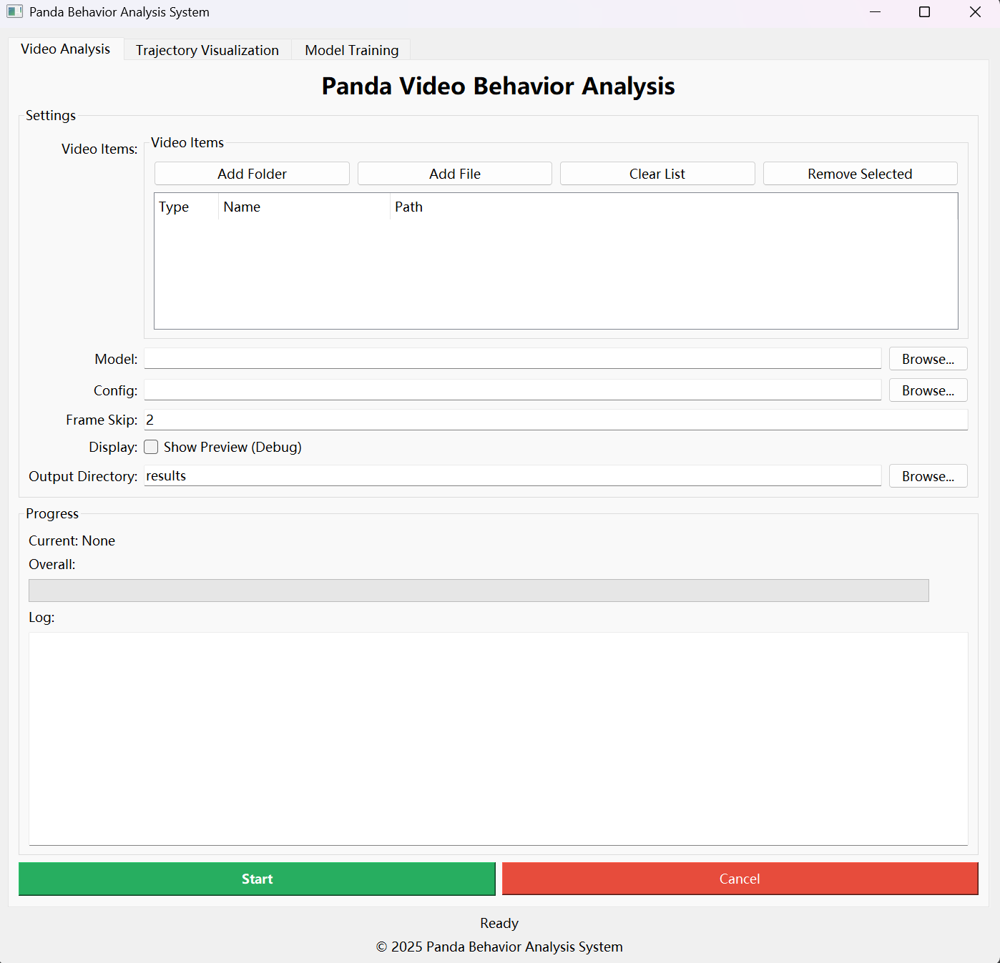
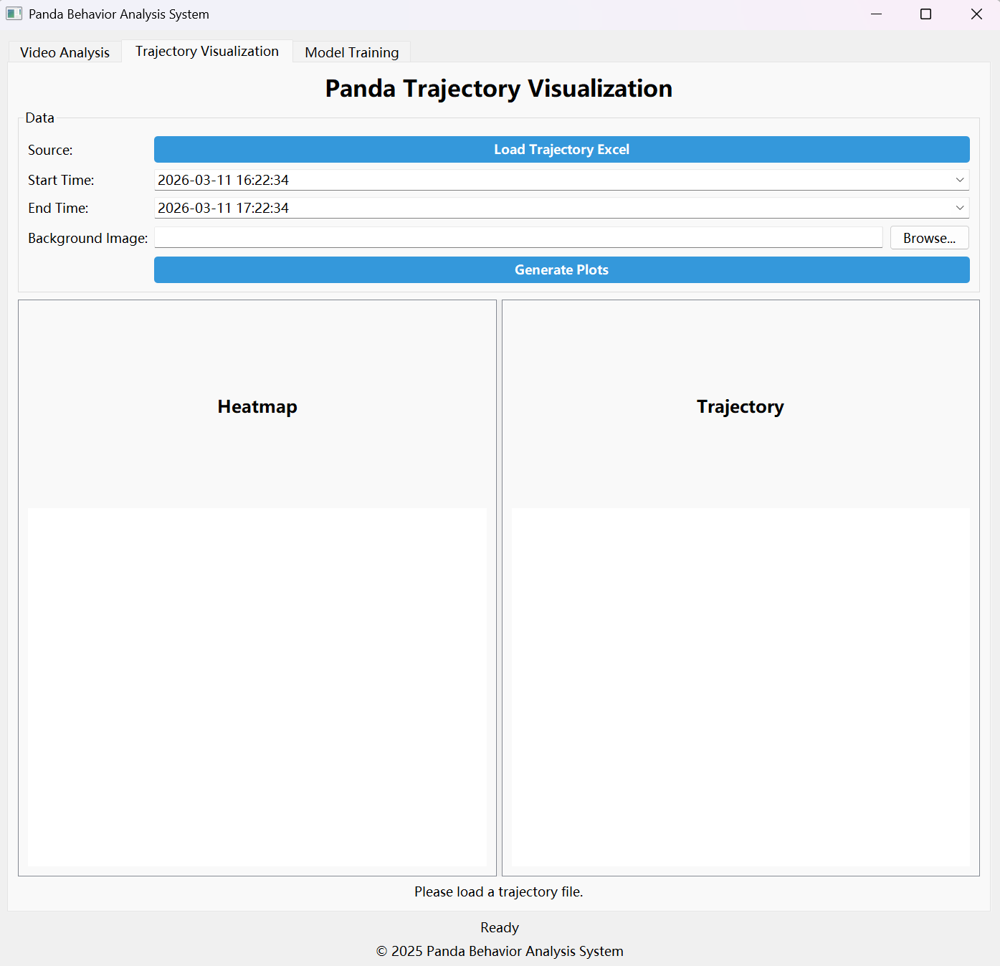
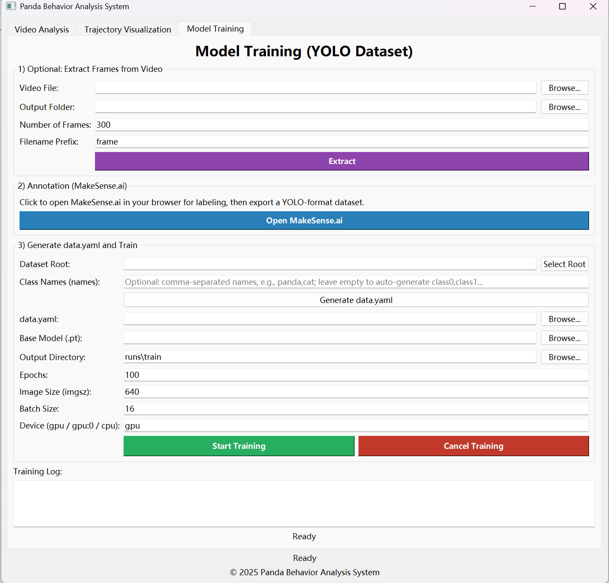

PandaTrack: A Computer Vision-Based Quantitative Spatial Behavioral Monitoring System for Captive Giant Pandas
---
Introduction
---
PandaTrack is an end-to-end computer vision framework for automated detection, tracking, and spatial behavior analysis of captive giant pandas in zoo environments.
The system integrates deep learning-based object detection with spatial statistical analysis, enabling transformation of raw surveillance videos into structured behavioral representations, including:
Individual movement trajectories
Grid-based enclosure utilization patterns
Spatial hotspot distributions
Behavioral spatial heterogeneity analysis
Compared with traditional manual observation, PandaTrack provides a quantitative, reproducible, and scalable framework for animal behavior analysis.
---
Installation
git clone https://github.com/wkj689/PandaTrack.git
cd PandaTrack
pip install -r requirements.txt
---
Usage
---
The PandaTrack system provides an integrated workflow consisting of three core functional modules, including video-based behavior analysis, trajectory and spatial visualization, and model training with dataset construction. Together, these modules form an end-to-end pipeline from raw video input to spatial behavioral analytics and model optimization.
---
(1) Video Analysis Module
In the “Video Analysis” module, users can import raw video data for automated behavioral analysis. The system supports both single-video input and batch folder processing. After loading the trained detection model, PandaTrack performs frame-by-frame inference to detect panda instances and extract their spatial positions.

---
(2)Trajectory and Spatial Visualization Module
The “Trajectory Visualization” module enables secondary analysis of preprocessed trajectory data by importing the generated trajectory.xlsx files.
This module supports:
Temporal filtering of trajectory data within user-defined time intervals
Generation of individual movement trajectory maps
Automated grid-based spatial heatmap construction
Visualization of trajectory overlays and spatial density distributions
By integrating temporal and spatial dimensions, the module allows quantitative assessment of habitat utilization patterns and behavioral space preferences.

---
(3) Model training module
The “Model Training” module enables users to train customized detection models using their own datasets.
The workflow includes:
Extracting frames from raw video sequences
Performing object annotation using external tools (e.g., MakeSense.ai)
Generating YOLO-format dataset configuration files (data.yaml)
Selecting pretrained weights and configuring training hyperparameters
Initiating model training with real-time monitoring of loss and performance metrics

---
PandaTrack Video Naming Format Instructions
---
To ensure that the program can correctly parse the shooting date and start time of each video, it is recommended that all videos to be analyzed be named using the following format:
YYYYMMDD_startHour_endHour.mp4
Format Description:
YYYYMMDD indicates the shooting date of the video.
For example, 20250803 means August 03, 2025.
startHour indicates the hour when the video recording starts. Please use two digits.
For example: 09, 12, 15, 23.
endHour indicates the hour when the video recording ends. Please use two digits.
For example: 12, 15, 18, 24.
The recommended file extension is .mp4.
Examples:
20250803_12_15.mp4
20250616_09_12.mp4
20250803_15_18.mp4

